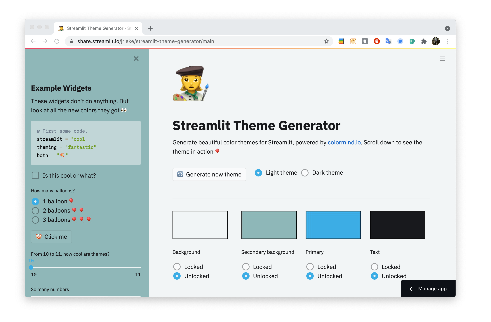

# Streamlit Theme Generator 👩‍🎨️

[](https://share.streamlit.io/jrieke/streamlit-theme-generator/main)

**Generate beautiful color themes for Streamlit, powered by [colormind.io](http://colormind.io/bootstrap/).**

[Theming in Streamlit](https://blog.streamlit.io/introducing-theming/) is awesome but
it's often hard to pick colors that match. This app generates beautiful color
palettes through [colormind.io](http://colormind.io/bootstrap/)
and applies them live to it's Streamlit theme. Just generate themes until you
find one you like and copy it to your own Streamlit app!

<br>

---

<h3 align="center">
    🌈 <a href="https://share.streamlit.io/jrieke/streamlit-theme-generator/main">Start coloring</a> 🌈
</h3>

---

<p align="center">
    <a href="https://share.streamlit.io/jrieke/streamlit-theme-generator/main"></a>
</p>

<br>

_For updates [follow me on Twitter](https://twitter.com/jrieke) ☺️_

<br>

---

<br>

**Note: The steps below are only required if you want to work on the app. If you just want to use it, go [here](https://share.streamlit.io/jrieke/streamlit-theme-generator/main).**

## Installation

```bash
git clone https://github.com/jrieke/streamlit-theme-generator.git
cd streamlit-theme-generator
pipenv install
```

## Running locally

```bash
streamlit run streamlit_app.py
```

## TODO

PRs are welcome! Please open an issue before you start working to coordinate.

TBA
